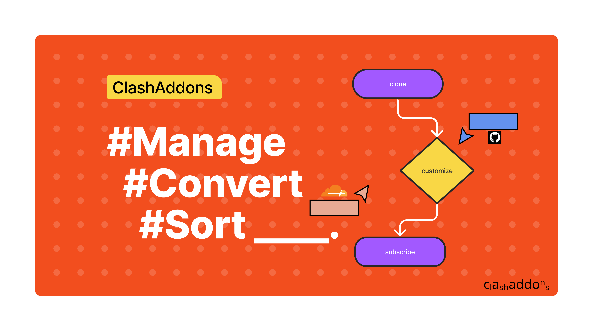
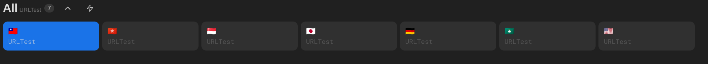
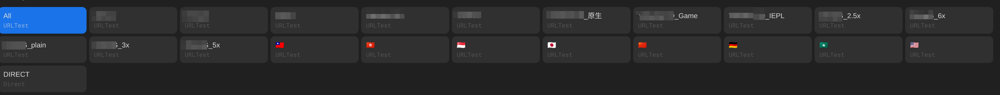

```
this is solely a project for me to practice python and learn asyncio

don't use it, unless you want to use a piece of shit

the doc bellow is solely used to prevent me from forgetting things and make the repository looks better
```

# <sub>Clash</sub>の<sup>Addons</sup>




**Selector**


## Demo

Subscribe for [Clash](https://clashaddons.pages.dev/clash) or [Quantumult X](https://clashaddons.pages.dev/quanx)

----

```text
for learning purpose.
```

Currently works as a wrapper of [subconverter](https://github.com/tindy2013/subconverter).
